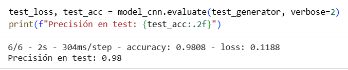
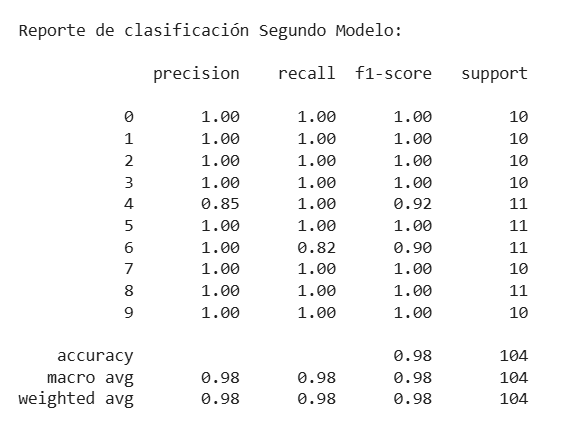
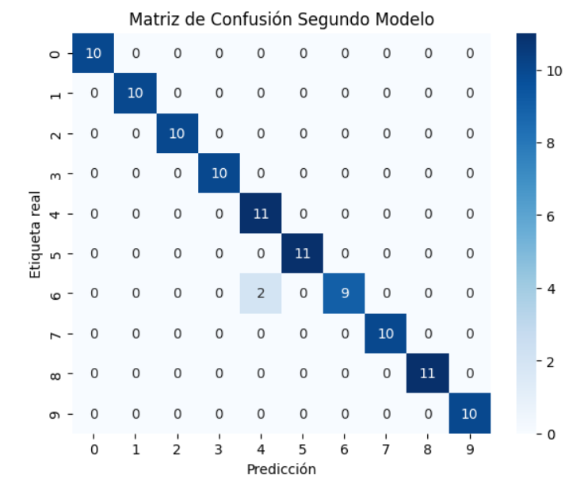
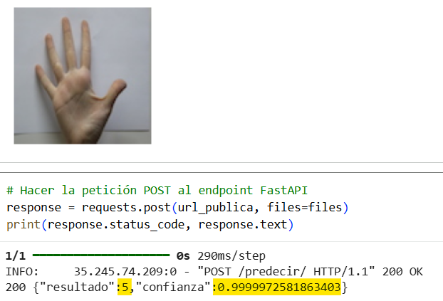
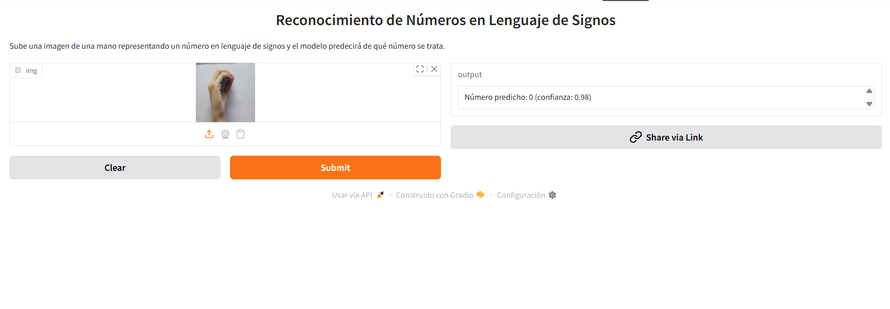

# Proyecto Redes Convolucionales Lenguaje de Signos

## Descripción  
Este proyecto implementa un sistema de visión por computador capaz de reconocer dígitos del 0 al 9 representados en lenguaje de signos a partir de imágenes. El modelo está basado en una **arquitectura CNN de estilo VGG-like**, formada por varios bloques convolucionales con BatchNormalization y Dropout, seguidos de una capa densa final para la clasificación.

El entrenamiento incorpora **data augmentation** y utiliza **callbacks** como EarlyStopping, ReduceLROnPlateau y ModelCheckpoint, que optimizan la convergencia, controlan el aprendizaje y reducen el riesgo de sobreajuste.

El modelo obtenido alcanza una **precisión del 98% en el conjunto de test**, demostrando una alta capacidad de generalización en la interpretación de dígitos en lengua de signos.

Además, fue expuesto públicamente mediante una **API desarrollada con FastAPI** y publicado en Hugging Face a través de una interfaz creada con Gradio.

---

## Estructura del Repositorio  
- data_examples/ → contiene algunas imágenes para probar el modelo.
- images → imágenes de diferentes partes de proyecto.
- notebooks/ → Dos cuadernos .ipynb, 'Numeros_modelo' con la construcción del modelo y 'Numeros_app' con el desarrollo de la API, además de una carpeta 'subir_hugging_face' con los archivos necesarios para que el modelo funcione desde HuggingFace.
- .gitignore → no hacer caso.
- LICENSE → licencia.
- README.md → documentación principal.
- requirements.txt → librerías necesarias para ejecutar el proyecto.

---

## Instalación y Uso  
1. Clonar este repositorio:
   
    *git clone https://github.com/juanmacbet/proyecto-cnn-digitos-lenguaje-signos.git*
3. Entrar en la carpeta del proyecto
4. Instalar las dependencias:
   
    *pip install -r requirements.txt*

---

## Resultados
Como resultado de realizar este proyecto se obtiene:

- Un modelo CNN entrenado para reconocer dígitos del 0 al 9 en lenguaje de signos con una **precisión del 98% en el conjunto de test**.
- Una **API REST pública** desarrollada con FastAPI que permite consultar el modelo desde cualquier cliente.
- Una interfaz sencilla y accesible publicada en Hugging Face mediante Gradio para realizar predicciones directamente desde el navegador: https://huggingface.co/spaces/juanmacbet/numeros_cnn
- Un caso práctico completo de clasificación de imágenes mediante **deep learning**, desde el preprocesamiento y entrenamiento hasta el despliegue del modelo.

---

## Visualizaciones
### Resultados del Modelo en el Conjunto de Test:  

### Reporte de Clasificación del Modelo en el Conjunto de Test:  

### Matriz de Confusión del Modelo en el Conjunto de Test:  

### Predicción desde la API:  

### Predicción desde HuggingFace:  

---

## Tecnologías Utilizadas

- **Python** → Lenguaje principal utilizado para el desarrollo completo del proyecto.
- **Visual Studio Code** → Entorno de desarrollo utilizado para escribir los archivos que servirían para subir el modelo a HuggingFace.
- **Google Colab** → Entorno en la nube utilizado para escribir el código, entrenar el modelo y probarlo.
- **TensorFlow / Keras** → Framework principal para construir, entrenar y evaluar la CNN.
- **Pandas** → Manipulación y análisis del dataset.
- **NumPy** → Operaciones numéricas y manejo de matrices.
- **Scikit-learn** → Utilizado para dividir el dataset (**train_test_split**) y para métricas de evaluación (**classification_report, confusion_matrix**).
- **Matplotlib / Seaborn** → Visualización de datos y resultados del modelo, incluyendo gráficas de confusión y análisis exploratorio.
- **Pillow (PIL)** → Manejo y preprocesamiento de imágenes para el modelo CNN.
- **ImageDataGenerator (Keras)** → Aumento de datos durante el entrenamiento de la CNN.
- **Callbacks de Keras** → Uso de **EarlyStopping, ReduceLROnPlateau y ModelCheckpoint** para optimizar el entrenamiento y evitar sobreajuste.
- **FastAPI** → API REST para exponer el modelo públicamente y permitir predicciones desde clientes externos.
- **Uvicorn / Nest-Asyncio / Pyngrok** → Servidor y túnel para ejecutar la API.
- **Gradio** → Interfaz web interactiva para probar el modelo de forma sencilla desde el navegador.
- **Gdown** → Descarga de archivos desde Google Drive al entorno de ejecución.
- **Git & GitHub** → Control de versiones y publicación del proyecto.

---

## Autor  

- **Juan Manuel Cano Betancourt**
- [GitHub](https://github.com/juanmacbet)
- [LinkedIn](https://www.linkedin.com/in/juan-manuel-cano-betancourt-1887401b7/)
- [Email](mailto:juanmacanobetancourt@gmail.com)

---

## Licencia

Este proyecto está bajo la licencia [MIT](./LICENSE).
